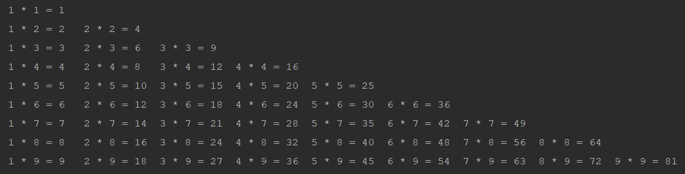

使用 `python` 如何打印如下图所示的九九乘法表呢。 



代码如下：

```python

row = 1

while row <= 9:
    col = 1
    while col <= row:
        print("%d * %d = %d" % (col, row, row * col), end="\t")
        col += 1
    row += 1
    print("")

```